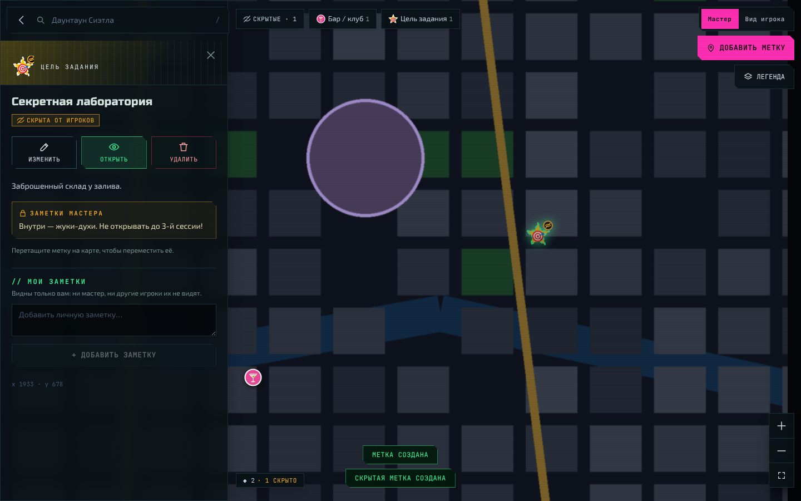
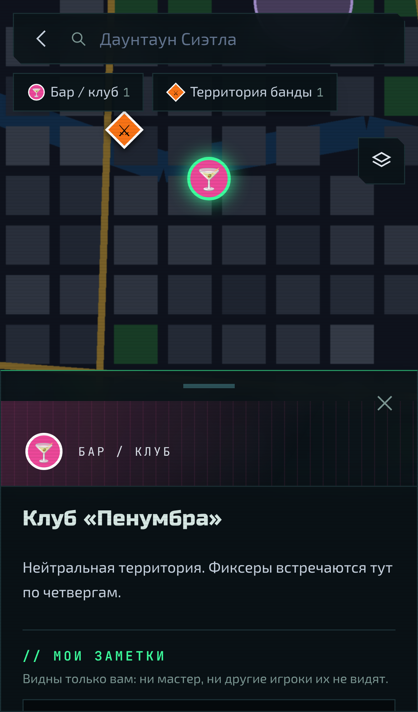
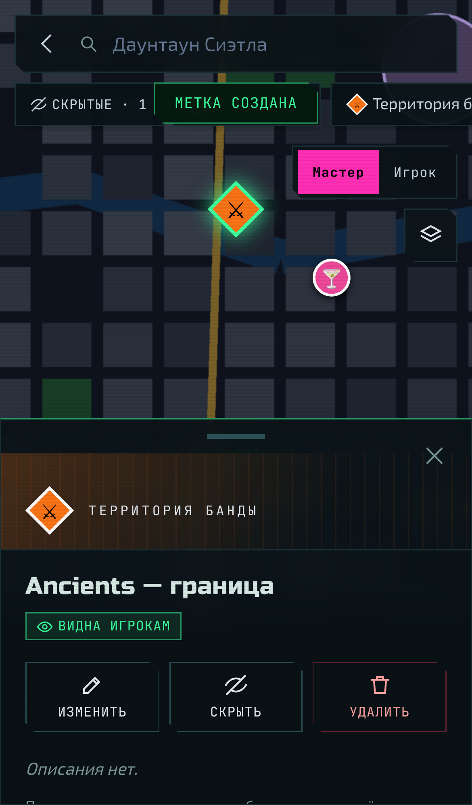
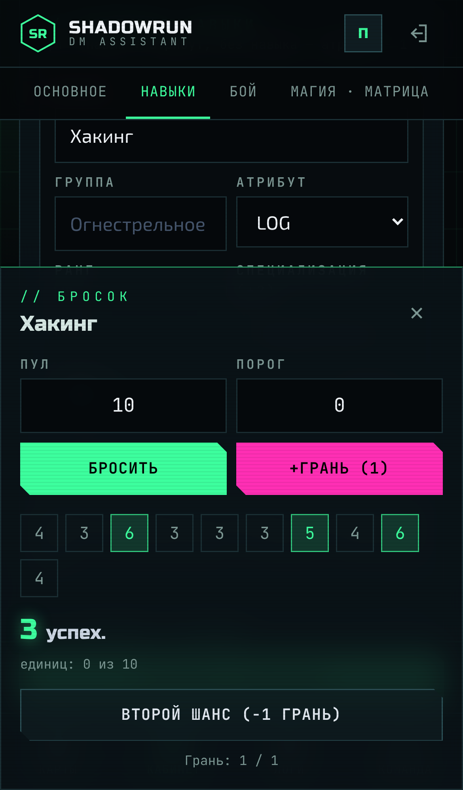
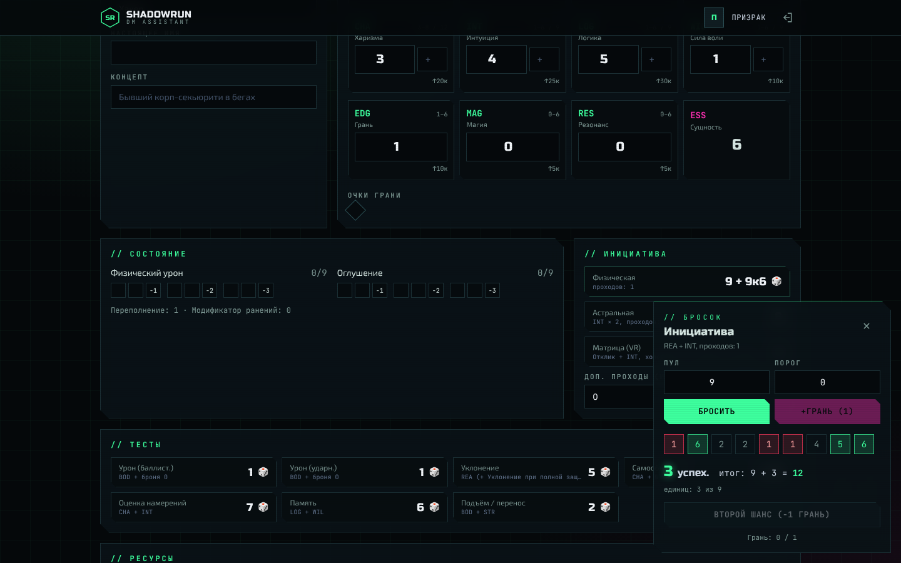
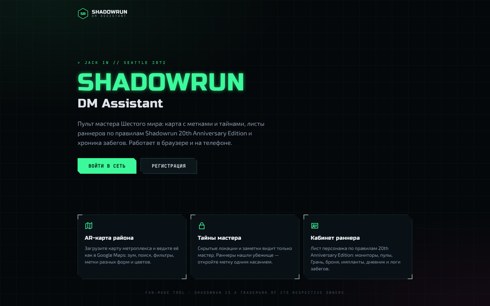

# Shadowrun DM Assistant

Онлайн-ассистент мастера **Shadowrun 20th Anniversary Edition** (SR4A). Главная фича — **интерактивная карта**:
мастер загружает изображение карты и работает с ним в интерфейсе в духе Google Maps.
На карте есть метки, тайные заметки мастера и скрытые локации, которые мастер открывает игрокам по ходу игры.
У игрока есть **кабинет**: лист персонажа по правилам SR4A, личный дневник героя и логи прошедших сессий.
Интерфейс оформлен в стилистике Шестого мира (AR-оверлей, неон, скошенные углы) и полностью адаптирован под телефоны.



| Телефон: игрок | Телефон: мастер | Броски SR4A |
|---|---|---|
|  |  |  |

| Лист персонажа | Главная |
|---|---|
|  |  |

## Возможности

### Интерактивная карта
- Загрузка карты в форматах PNG, JPEG, GIF и WebP, до 50 МБ и до 30 000 px по стороне. Реальный формат проверяется по сигнатуре файла, размеры читаются из заголовка.
- Зум колесом или пинчем, перетаскивание, кнопки «+ / − / вся карта», плавный перелёт к метке.
- Поиск по меткам (горячая клавиша `/`), фильтр-чипы по типам, легенда и переключение между картами кампании.
- Панель метки в стиле Google Maps: слева на десктопе, на телефоне — нижняя шторка, которую можно потянуть вверх.
- **Режим мастера:**
  - создание меток кнопкой (на телефоне — плавающая кнопка «+» и касание карты) или через правый клик / долгое нажатие («Добавить метку здесь»), редактирование, удаление, перемещение перетаскиванием;
  - каталог меток: 16 встроенных типов локаций (8 форм × свой цвет и значок) и свои типы для кампании;
  - **тайные заметки мастера** на каждой метке, игрокам они не отправляются никогда;
  - **скрытые метки** видит только мастер. Пунктирный контур и значок «перечёркнутый глаз» показывают, что метка скрыта. Одной кнопкой метку можно «Открыть» игрокам и снова «Скрыть»;
  - переключатель «Вид игрока» показывает карту глазами игроков.
- **Режим игрока:** видны только открытые метки с публичным описанием. К любой метке можно писать **личные заметки**: их видит только автор, ни мастер, ни другие игроки их не видят. Карта опрашивает сервер каждые 10 секунд, поэтому открытая мастером локация появляется у игроков почти сразу.

### Кабинет игрока: правила Shadowrun 20th Anniversary Edition
- **Метатипы** с таблицей атрибутов SR4A: естественные диапазоны (например, у тролля Телосложение 5–10), аугментированный максимум ×1.5, расовые особенности; атрибуты записываются как «естественный (аугментированный)».
- **Мониторы состояния**: физический 8 + ⌈BOD/2⌉, оглушение 8 + ⌈WIL/2⌉, переполнение = BOD, модификатор −1 за каждые 3 клетки на каждой шкале (учитывается в бросках).
- **Инициатива** REA + INT + успехи броска, проходы инициативы (1 + импланты/заклинания, максимум 4); астральная INT × 2 (3 прохода); матричная в VR Отклик + INT (холодный 2 / горячий 3 прохода).
- **Броня**: баллистическая и ударная; лучшая надетая броня плюс добавочные предметы (шлем, щит), +1 у тролля; предупреждение, если броня тяжелее Телосложения × 2. Пулы сопротивления урону BOD + броня.
- **Сущность** 6 − импланты; потеря Магии/Резонанса на 1 за каждый потерянный пункт сущности или его часть.
- **Магия и Матрица**: традиция (герметическая — сопротивление истощению WIL + LOG, шаманская — WIL + CHA, техномант — угасание WIL + RES), заклинания с типом, дальностью, длительностью и истощением, силы адепта с очками сил, коммлинк (Отклик, Сигнал, Система, Файрвол) и программы.
- **Навыки** с группами и специализациями (пул = навык + атрибут, без навыка — атрибут − 1), **знания и языки** (уличные/интересы — INT, академические/профессиональные — LOG, бесплатные очки (INT + LOG) × 3), **качества в BP** с лимитом 35/35, стоимость повышения в карме (атрибут — новый ранг × 5, навык — × 2, новый навык — 4).
- **Тесты атрибутов**: самообладание, оценка намерений, память, подъём/перенос, уклонение.
- **Кубики SR4A**: успех на 5–6, **сбой — если единиц половина или больше**, критический сбой — сбой без успехов; порог и чистые успехи; **Грань до броска** (+Грань кубиков и правило шестёрок) или **второй шанс** после броска (переброс промахов), очки Грани списываются с листа.
- Оружие (урон, ББ, режим, отдача, боезапас, досягаемость) с броском атаки по выбранному навыку, снаряжение, транспорт и дроны, контакты (связи/лояльность), образ жизни со стоимостью, СИНы, карма, уличный авторитет, дурная слава, известность.
- **Дневник персонажа**: приватные заметки игрока.
- **Логи прошлых игр**: хроника сессий. Мастер пишет отчёты, черновики видит только он, опубликованные логи видят все.

### Телефоны
- Нижняя панель вкладок (Карты · Кабинет · Логи · Команда), диалоги открываются нижними шторками.
- Карта на весь экран с учётом выреза и «домашней полоски» (safe area), шторка метки тянется пальцем между половиной и полным экраном.
- Лист персонажа без горизонтальной прокрутки: таблицы превращаются в карточки, кнопка «Сохранить изменения» закреплена над панелью вкладок.
- Поля ввода 16 px (iOS не зумит страницу), кнопки не меньше 44 px.

### Роли
Роли привязаны к кампании: в одной кампании человек может быть владельцем, а в другой игроком.

| Действие | Владелец | Мастер | Игрок |
|---|:-:|:-:|:-:|
| Управлять участниками и ролями, код приглашения, удалить кампанию | ✅ | — | — |
| Загружать карты, создавать, менять и удалять метки, свои типы меток | ✅ | ✅ | — |
| Видеть скрытые метки и тайные заметки мастера | ✅ | ✅ | — |
| Писать и публиковать логи сессий, видеть черновики | ✅ | ✅ | — |
| Смотреть листы всех персонажей (только чтение) | ✅ | ✅ | — |
| Видеть открытые метки, личные заметки на метках | ✅ | ✅ | ✅ |
| Свои персонажи и дневник | ✅ | ✅ | ✅ |

Создатель кампании становится владельцем. Остальные присоединяются как игроки по ссылке-приглашению (`https://ваш-сайт/join/КОД`, кнопка «Поделиться» на вкладке «Команда») или вводят код вручную; владелец может повысить игрока до мастера.

## Архитектура

```
Браузер ──cookie──▶ Next.js 16 (frontend) ──Bearer JWT──▶ Spring Boot 4 (backend, монолит) ──▶ PostgreSQL
                   │  Auth0 SDK, BFF-прокси /api/backend/*                     │ Flyway, JPA
                   └──────────────── Auth0 (Universal Login) ◀─────────────────┘ проверка JWT
```

- **backend/**: Spring Boot 4.1 на Java 21, монолит. Spring Security работает как OAuth2 Resource Server и проверяет access token Auth0 (issuer, audience, подпись по JWKS). Пользователь создаётся при первом запросе по `sub`. Все проверки ролей выполняются на сервере в `CampaignAccess`. Схема БД ведётся миграциями Flyway. Изображения карт хранятся на диске (интерфейс `MapStorage`, его можно заменить на S3).
- **frontend/**: Next.js 16 (App Router) на React 19, Tailwind 4 (шрифты Russo One, Exo 2, JetBrains Mono), Leaflet и react-leaflet (`CRS.Simple`, координаты меток в пикселях изображения) и SWR. Вход через `@auth0/nextjs-auth0` v4. Браузер ходит в API только через route handler `/api/backend/*`: он подставляет access token на сервере, поэтому токены не попадают в JS браузера, а защищённые изображения карт грузятся обычным ``.

## Запуск на своём сервере

Пошаговая инструкция для новичка — от SSH-подключения и домена до настройки Auth0, HTTPS и бэкапов: **[DEPLOY.md](DEPLOY.md)**.
Коротко: `cp .env.production.example .env`, заполнить, `docker compose up -d --build` —
Caddy сам получит HTTPS-сертификат, наружу открыты только порты 80/443.

## Быстрый старт без Auth0 (локальный dev-вход)

Нужны Java 21, Node 20.9+ и PostgreSQL. В dev-режиме Auth0 заменён формой «войти под любым именем»: разные имена — разные пользователи, так удобно проверять роли в двух окнах браузера.

```bash
# 1. База
createuser -P dm_assistant          # пароль: dm_assistant
createdb -O dm_assistant dm_assistant

# 2. Backend (порт 8080)
cd backend
DEV_AUTH_ENABLED=true DEV_AUTH_SECRET=change-me-to-a-long-random-string-32chars ./mvnw spring-boot:run

# 3. Frontend (порт 3000)
cd frontend
npm install
AUTH_MODE=dev DEV_AUTH_SECRET=change-me-to-a-long-random-string-32chars npm run dev
```

Откройте http://localhost:3000. Чтобы проверить роли: войдите как «Мастер», создайте кампанию и загрузите карту. Затем в приватном окне войдите как «Игрок» и присоединитесь по коду со страницы «Участники».

> ⚠️ Dev-вход принимает токены, подписанные общим секретом. **Никогда не включайте его на публичном сервере.**

Локально через Docker: `cp .env.example .env`, заполните переменные (или раскомментируйте dev-режим), затем `docker compose up --build`. Для сервера используйте `docker-compose.prod.yml` (см. [DEPLOY.md](DEPLOY.md)).

## Настройка Auth0

1. **API.** Auth0 Dashboard → Applications → APIs → *Create API*. Identifier, например, `https://dm-assistant/api` — это `AUTH0_AUDIENCE`. Алгоритм RS256.
2. **Приложение.** Applications → *Create Application* → **Regular Web Application**.
   - Allowed Callback URLs: `http://localhost:3000/auth/callback`
   - Allowed Logout URLs: `http://localhost:3000`
   - Advanced → Grant Types: должен быть включён Refresh Token. В настройках API включите *Allow Offline Access*.
3. **Переменные окружения.**

   `frontend/.env.local` (см. `frontend/.env.example`):
   ```
   BACKEND_URL=http://localhost:8080
   AUTH0_DOMAIN=my-tenant.eu.auth0.com
   AUTH0_CLIENT_ID=…
   AUTH0_CLIENT_SECRET=…
   AUTH0_SECRET=<openssl rand -hex 32>
   AUTH0_AUDIENCE=https://dm-assistant/api
   APP_BASE_URL=http://localhost:3000
   ```
   backend:
   ```
   AUTH0_ISSUER=https://my-tenant.eu.auth0.com/
   AUTH0_AUDIENCE=https://dm-assistant/api
   DB_URL=jdbc:postgresql://localhost:5432/dm_assistant
   DB_USERNAME=dm_assistant
   DB_PASSWORD=…
   MAPS_DIR=./data/maps
   ```

Access token Auth0 не содержит имени и email, поэтому после входа фронтенд один раз копирует профиль из ID token в `PUT /api/me`.

## API (кратко)

Все пути начинаются с `/api`, требуют `Authorization: Bearer <JWT>`, ошибки возвращаются в формате `application/problem+json`.

| Ресурс | Эндпоинты |
|---|---|
| Профиль | `GET/PUT /me` |
| Кампании | `GET/POST /campaigns`, `POST /campaigns/join`, `GET/PUT/DELETE /campaigns/{id}`, `POST /campaigns/{id}/invite-code` |
| Участники | `GET /campaigns/{id}/members`, `PATCH/DELETE /campaigns/{id}/members/{memberId}` |
| Карты | `GET/POST(multipart) /campaigns/{id}/maps`, `GET/PUT/DELETE …/maps/{mapId}`, `GET …/maps/{mapId}/image` |
| Типы меток | `GET/POST /campaigns/{id}/marker-types`, `PUT/DELETE …/marker-types/{typeId}` |
| Метки | `GET/POST …/maps/{mapId}/markers`, `PUT/DELETE …/markers/{markerId}`, `PATCH …/markers/{markerId}/visibility` |
| Личные заметки на метках | `GET …/maps/{mapId}/my-notes`, `POST …/markers/{markerId}/my-notes`, `PUT/DELETE /campaigns/{id}/my-notes/{noteId}` |
| Персонажи | `GET/POST /campaigns/{id}/characters`, `GET/PUT/DELETE …/characters/{characterId}` |
| Дневник персонажа | `GET/POST …/characters/{characterId}/notes`, `PUT/DELETE …/notes/{noteId}` |
| Логи сессий | `GET/POST /campaigns/{id}/session-logs`, `GET/PUT/DELETE …/session-logs/{logId}` |

Игроку сервер вообще не отдаёт скрытые метки, а поле `gmNotes` у меток для него всегда `null`. Фильтрация на клиенте нужна только для режима «Вид игрока» у мастера.

## Тесты и проверки

```bash
cd backend && ./mvnw test                 # интеграционные тесты API (H2, MockMvc, JWT)
cd frontend && npm test && npx tsc --noEmit && npm run lint && npm run build
```

`npm test` прогоняет юнит-тесты правил SR4A (мониторы, инициатива, броня, сущность, сбои, правило шестёрок, второй шанс).
Интеграционные тесты бэкенда проверяют права доступа: скрытые метки и заметки мастера не доходят до игроков, личные заметки приватны, игрок не может менять карту, черновики логов скрыты, мастер видит лист игрока только на чтение, последнего владельца нельзя понизить, посторонний получает 404.
